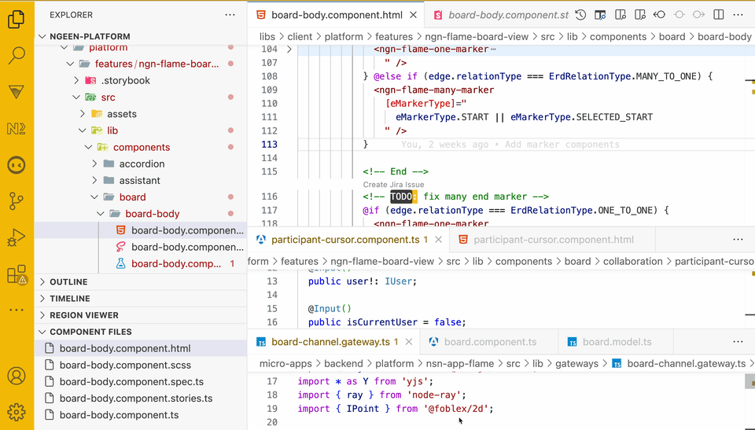

# angular-component-quick-jump (WIP)

Quick jump feature in angular component folders. Sometimes other extensions or too deep folder hierarchy makes it hard to find the component you are looking for. This extension will help you to quickly jump to the component you are looking for. It's saves scroll + click time.

## Preview

## Notes

This extension is only for angular component folders. It will not work for other folders. Also, it's not published yet. You can clone the repo and install it locally.
